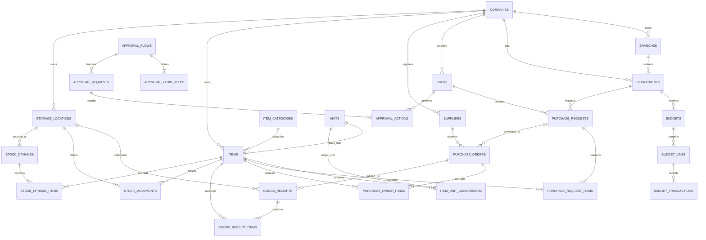

# SAMS Database & ERD v1

Status: Draft implementation baseline  
Scope: SAMS MVP (multi-company, multi-branch, inventory, purchasing, budget, approval, and audit)

## Design Principles

- Every operational record belongs to a company and, where relevant, a branch.
- Monetary values use `decimal(19,4)`.
- Quantities use `decimal(19,4)`.
- Transaction numbers are human-readable but UUIDs are used as public identifiers.
- Posted inventory transactions are immutable; corrections use reversal transactions.
- Approval history is stored separately from the current document status.
- Master data uses soft deletes where historical transactions may reference it.
- All timestamps are stored in UTC and presented in the property's timezone.

## MVP Modules

### Core

- companies
- branches
- departments
- users
- roles and permissions
- document_sequences
- attachments
- audit_logs

### Approval

- approval_flows
- approval_flow_steps
- approval_requests
- approval_actions

### Master Data

- suppliers
- item_categories
- units
- storage_locations
- items
- item_unit_conversions

### Budget

- budgets
- budget_lines
- budget_transactions

### Purchasing

- purchase_requests
- purchase_request_items
- purchase_orders
- purchase_order_items

### Inventory

- goods_receipts
- goods_receipt_items
- stock_movements
- stock_opnames
- stock_opname_items

## Main ERD

## Required Statuses

### Purchase Request

`draft`, `submitted`, `in_review`, `approved`, `rejected`, `converted`, `closed`, `cancelled`

### Purchase Order

`draft`, `in_review`, `approved`, `sent`, `partially_received`, `fully_received`, `closed`, `cancelled`

### Goods Receipt

`draft`, `posted`, `reversed`, `cancelled`

### Stock Opname

`draft`, `counting`, `submitted`, `approved`, `posted`, `cancelled`

### Approval Request

`pending`, `approved`, `rejected`, `cancelled`

## Important Constraints

- Document numbers are unique per company, branch, document type, and fiscal period.
- An approved purchase request cannot be edited; it must be revised or cancelled.
- Ordered quantity cannot exceed approved request quantity without a new approval.
- Received quantity cannot exceed the configured PO tolerance.
- Every posted receipt and opname adjustment creates balanced stock movements.
- Stock balance is calculated from stock movements; it is not the primary ledger.
- Approval actions are append-only.
- Audit logs record actor, event, entity, old values, new values, IP address, and request correlation ID.

## Recommended Migration Order

1. companies
2. branches
3. departments
4. users and authorization tables
5. document_sequences
6. attachments and audit_logs
7. approval_flows and approval_flow_steps
8. approval_requests and approval_actions
9. suppliers
10. item_categories
11. units
12. storage_locations
13. items and item_unit_conversions
14. budgets, budget_lines, and budget_transactions
15. purchase_requests and purchase_request_items
16. purchase_orders and purchase_order_items
17. goods_receipts and goods_receipt_items
18. stock_movements
19. stock_opnames and stock_opname_items

## Laravel Baseline

- Laravel 12
- PHP 8.3 or later
- PostgreSQL 16 preferred; MySQL 8.0 is supported
- Blade + Livewire for the first web application
- Sanctum for future mobile and integration APIs
- Queue-backed notifications and report generation
- Spatie Laravel Permission may be used for RBAC

## Deferred After MVP

- Fixed assets, maintenance, and depreciation
- Finance/GL integration
- POS and hotel-system integration
- Forecasting and AI recommendations
- Mobile applications and offline synchronization

